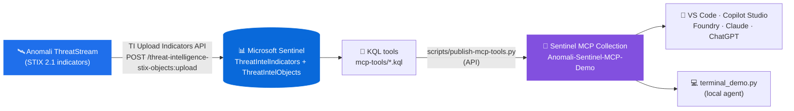

# Anomali Sentinel MCP Demo (UI variant)

This is the **UI-publish variant** of the [`anomali-sentinel-mcp-demo`](https://github.com/MitchellGulledge3/anomali-sentinel-mcp-demo) repo. The MCP tools are identical; the only difference is that this variant publishes them by hand in the Microsoft Defender portal instead of through the Sentinel custom MCP API.

This repo is a GitHub-ready reference implementation for an **Anomali ThreatStream** developer who wants to show an end-to-end Microsoft Sentinel custom MCP tool integration on top of the **Threat Intelligence Upload Indicators API**.

The purpose is not to ship another generic chatbot. The purpose is to show how an ISV can expose focused, high-value threat-intelligence capabilities as **MCP tools** over the indicators they already publish into Sentinel. Once those tools exist, a terminal demo, an ISV product experience, a Copilot-style UI, or any other agent runtime can call the same capability.

## The story in one sentence

Anomali ThreatStream publishes STIX 2.1 indicators into Microsoft Sentinel via the TI Upload Indicators API; MCP turns those indicators into reusable agent tools such as *"summarize my active feed,"* *"surface high-confidence IOCs,"* *"audit feed freshness,"* and the flagship *"are any Anomali IOCs hitting in our environment right now?"*

## Architecture at a glance



## Recommended path for a live working session

If you are walking through this with an Anomali developer, start here:

[`docs/working-session-guide.md`](docs/working-session-guide.md)

## New to Sentinel threat intelligence? Read this first

| Term | Plain-English meaning |
| --- | --- |
| Microsoft Sentinel | Microsoft's cloud SIEM. Collects logs, detects threats, drives investigation. |
| Log Analytics workspace | The Azure data store Sentinel uses for logs. Workspace customer ID is a GUID. |
| `ThreatIntelIndicators` | Microsoft-managed table where STIX **indicators** land after ingestion. |
| `ThreatIntelObjects` | Microsoft-managed table for non-indicator STIX objects (threat-actor, campaign, malware, relationship). |
| `ThreatIntelligenceIndicator` | Legacy table — **retired July 31, 2025**. This demo uses the new tables. |
| STIX 2.1 | The structured threat intel format Anomali sends. Each indicator has a pattern, confidence, labels, kill-chain phase, external_references. |
| TI Upload Indicators API | The push API used by Anomali (and other TIPs) to POST STIX objects directly into a Sentinel workspace. |
| TAXII | The pull integration. Anomali ThreatStream also exposes a TAXII server; Sentinel's built-in TAXII connector can pull from it. This demo focuses on the push path. |
| MCP tool | A callable tool an agent can use. In this repo, each MCP tool runs one curated KQL query over the TI tables. |

The short version: **the TI Upload API pushes Anomali-shaped STIX indicators into Sentinel's `ThreatIntelIndicators` table; KQL asks useful security questions about those indicators; MCP wraps those questions so an agent or app can call them.**

## What this demo proves

An Anomali developer can:

1. POST Anomali-shaped STIX 2.1 indicators directly into Sentinel using the official **TI Upload Indicators API** — the same path Anomali ThreatStream uses in production.
2. Query the indicators that land in Sentinel's managed `ThreatIntelIndicators` and `ThreatIntelObjects` tables.
3. Publish high-value KQL questions as Sentinel custom MCP tools.
4. Call those tools from a simple terminal prompt loop or any future agent runtime.

## What gets created

| Asset | Created by | Why it exists |
| --- | --- | --- |
| Anomali-shaped STIX 2.1 indicators in `ThreatIntelIndicators` | `seed/upload-anomali-indicators.py` | Realistic demo IOCs uploaded via the real TI Upload API |
| `Anomali-Sentinel-MCP-Demo` collection | `scripts/publish-mcp-tools.py` | Groups the custom MCP tools |
| Six MCP tools | `scripts/publish-mcp-tools.py` | Expose repeatable Anomali investigation questions |
| Terminal demo | `terminal_demo.py` | Lets a presenter call the tools from a prompt |

## Why this matters for Anomali developers

The developer does not have to ship a chatbot to participate in agent workflows. They ship a small set of opinionated tools around the threat-intel questions Anomali is best positioned to answer:

| Developer asset | Why it helps |
| --- | --- |
| Real TI Upload API path | Demo data flows through the same API your ThreatStream connector uses |
| `ThreatIntelIndicators` queries | Aligned to the new STIX schema Microsoft introduced in 2025 |
| KQL files | Make the security logic inspectable, reviewable, and versionable |
| MCP publisher script | Converts KQL into callable custom tools |
| Terminal demo | Shows the end-to-end tool call without Teams, browser, or admin-consent friction |

## End-to-end use case

**Use case:** a SOC analyst asks Copilot whether any indicators Anomali ThreatStream is tracking are showing up in *their* Sentinel workspace right now.

The MCP tools expose that investigation as reusable capabilities:

| Tool | Purpose |
| --- | --- |
| `Anomali_Active_Indicator_Summary` | Executive feed summary: total active, by type, by confidence bucket, by TLP |
| `Anomali_High_Confidence_IOC_Hunt` | Surface highest-confidence (>=80) indicators with labels, kill-chain, ThreatStream external_id |
| ★ `Anomali_IOC_Match_In_Workspace` | Pivot Anomali IPv4 / domain / URL indicators against `CommonSecurityLog` and `DnsEvents` to find **live hits in the workspace** |
| `Anomali_Indicator_Freshness_Audit` | Feed hygiene: stale > 14d, expiring soon, already expired, last-update method breakdown |
| `Anomali_Campaign_Tracker` | Surface threat-actor / campaign / malware STIX objects and related indicators |
| `Anomali_Top_Observable_Types` | Break down indicators by observable type (ipv4, domain, url, sha256, email) |

The flagship is `Anomali_IOC_Match_In_Workspace` — it answers the single highest-value SOC question: *"out of the IOCs Anomali tracks, which ones are firing in MY environment right now?"* One MCP call, joined against `CommonSecurityLog` and `DnsEvents`, returns the answer.

For the full narrative and talk track for each tool, see [`docs/tool-use-cases.md`](docs/tool-use-cases.md).

## Prerequisites

You'll need:

1. **An Azure subscription** with a **Log Analytics workspace** that has **Microsoft Sentinel** enabled.
2. **Permission to use the TI Upload Indicators API** on that workspace — the caller's identity needs the **Microsoft Sentinel Contributor** role (or a custom role with `Microsoft.SecurityInsights/threatIntelligence/upload-stix-objects/action`).
3. **Azure CLI** (`az`) authenticated against that subscription:
   ```bash
   brew install azure-cli         # if you don't already have it
   az login
   az account set --subscription "<subscription-id-or-name>"
   ```
4. **Python 3.9+** for the seed, publisher, and terminal demo (`python3 --version`).
5. **Permission to publish Sentinel custom MCP tool collections.** The publishing helper calls `https://api.securityplatform.microsoft.com/aiprimitives/mcpToolCollections` and acquires an Azure AD token for the resource ID `4500ebfb-89b6-4b14-a480-7f749797bfcd` (Sentinel Platform Services). Your identity must be allowed to create or update MCP tool collections in the target tenant.

> Note: unlike the other partner demos in this series, this repo does **not** use `sentinel-logseeder`. Anomali data lands in Microsoft-managed TI tables, not a custom `_CL` table — so the seed step uses the real TI Upload Indicators API instead of LogSeeder. This more accurately mirrors how Anomali ThreatStream data actually reaches Sentinel.

### Get your workspace customer ID

The seed script and publisher ask for `<workspace-customer-id>` — the Log Analytics **workspace ID** (a GUID), **not** the Azure resource ID. Find yours with:

```bash
az monitor log-analytics workspace show \
  --resource-group <rg> \
  --workspace-name <workspace> \
  --query customerId -o tsv
```

### Authentication

Both the seed script and the publisher use Azure CLI (`az account get-access-token`) under the hood. The seed script asks Azure CLI for a token against `https://management.azure.com` (the resource the TI Upload API accepts). The publisher asks for a token against the Sentinel Platform Services resource ID.

If you'd rather use a service principal for the terminal demo, set the standard env vars before running:

```bash
export AZURE_TENANT_ID=...
export AZURE_CLIENT_ID=...
export AZURE_CLIENT_SECRET=...
```

## Seed data with the TI Upload Indicators API

This step POSTs Anomali-shaped STIX 2.1 indicators directly into Sentinel via the official Upload Indicators API:

```
POST https://api.ti.sentinel.azure.com/workspaces/{workspaceId}/threat-intelligence-stix-objects:upload?api-version=2024-02-01-preview
```

The payload uses `sourcesystem: "Anomali ThreatStream"` so the indicators are clearly attributed to Anomali in `ThreatIntelIndicators.SourceSystem` after ingestion.

```bash
export REPO_ROOT=$(pwd)
export WORKSPACE_ID=<workspace-customer-id>

# Preview the payload locally without calling the API:
python3 "$REPO_ROOT/seed/upload-anomali-indicators.py" \
  --workspace-id "$WORKSPACE_ID" \
  --count 5 \
  --dry-run

# Real upload — 200 indicators in 2 batches + a handful of threat-actor objects:
python3 "$REPO_ROOT/seed/upload-anomali-indicators.py" \
  --workspace-id "$WORKSPACE_ID" \
  --count 200 \
  --include-actors
```

Limits to remember (enforced by the API):

- **100 STIX objects per request** (the script batches automatically)
- **100 requests per minute**, ~10K objects/minute throughput
- The `sourcesystem` value `"Microsoft Sentinel"` is **not** allowed — this script uses `"Anomali ThreatStream"`

Verify rows after upload (allow 5–10 minutes for the indicators to surface in queries):

```kql
ThreatIntelIndicators
| where SourceSystem == "Anomali ThreatStream"
| summarize Indicators=count(), FirstSeen=min(Created), LastSeen=max(Modified)
```

```kql
ThreatIntelIndicators
| where SourceSystem == "Anomali ThreatStream"
| extend Pattern = tostring(Pattern)
| extend IndicatorType = case(
    Pattern has "ipv4-addr:value",   "ipv4-addr",
    Pattern has "domain-name:value", "domain-name",
    Pattern has "url:value",         "url",
    Pattern has "file:hashes",       "file-hash",
    "other")
| summarize count() by IndicatorType
```

## Publish custom MCP tools (UI flow)

This repo intentionally has **no publisher script**. Instead, you publish each KQL query in `mcp-tools/` as a custom Sentinel MCP tool by hand, using the **Save as tool** flow in the Microsoft Defender portal's Advanced Hunting experience.

Full step-by-step walkthrough: [`docs/publish-tools-via-ui.md`](docs/publish-tools-via-ui.md)

Suggested collection name:

```text
Anomali-Sentinel-MCP-Demo
```

Use this when you want to demo the no-code path or when API-based publishing isn't available in your tenant. The terminal demo and KQL files are unchanged — they call whatever collection ends up published.

## Terminal demo

```bash
cd "$REPO_ROOT"
python3 -m venv .venv
source .venv/bin/activate
pip install -r requirements.txt
cp .env.example .env
```

Edit `.env` and set:

```text
MCP_DEFAULT_ARGUMENTS={"workspaceId":"<workspace-customer-id>"}
```

Then start the app:

```bash
python3 terminal_demo.py --show-raw
```

Type prompts like:

```text
Summarize Anomali ThreatStream indicators
Show the highest-confidence IOCs
Are any Anomali IOCs hitting in our workspace right now?
Audit Anomali feed freshness and expiring indicators
Track Anomali campaigns and threat actors
Break down indicators by observable type
```

Single-shot run:

```bash
python3 terminal_demo.py --prompt "Are any Anomali IOCs hitting in our workspace right now?" --show-raw
```

The terminal demo has a simple prompt router:

| Prompt contains | Tool selected |
| --- | --- |
| `match`, `live`, `hit`, `pivot`, `workspace`, `see this` | `Anomali_IOC_Match_In_Workspace` |
| `high confidence`, `high-confidence`, `top ioc`, `trusted ioc` | `Anomali_High_Confidence_IOC_Hunt` |
| `fresh`, `stale`, `expir`, `hygiene`, `audit`, `last update` | `Anomali_Indicator_Freshness_Audit` |
| `campaign`, `actor`, `apt`, `intrusion set` | `Anomali_Campaign_Tracker` |
| `type`, `observable`, `breakdown`, `ipv4`, `domain`, `sha` | `Anomali_Top_Observable_Types` |
| anything else | `Anomali_Active_Indicator_Summary` |

## Troubleshooting quick hits

| Symptom | Likely cause | Fix |
| --- | --- | --- |
| `az` token errors | Azure CLI is not signed in or points to the wrong tenant | `az login`, `az account set --subscription <id>` |
| Upload returns HTTP 403 | Identity missing `threatIntelligence/upload-stix-objects/action` | Assign Microsoft Sentinel Contributor on the workspace |
| Upload returns HTTP 400 with `sourcesystem` error | `sourcesystem` was set to a reserved value | This script uses `"Anomali ThreatStream"`; verify you didn't change it |
| Upload returns HTTP 429 | Throttled (100 req/min, 10K objects/min) | Reduce `--count` or add a sleep between batches |
| Indicators ingested but queries return 0 rows | Ingestion-to-query lag | Wait 5–10 minutes, then re-run the verification KQL |
| MCP publish fails with permission errors | Missing Sentinel custom MCP management permission | Use an account allowed to publish MCP tool collections |
| Terminal demo says workspace is missing | `.env` does not contain `MCP_DEFAULT_ARGUMENTS` | Set `{"workspaceId":"<workspace-customer-id>"}` |

## Talk track

> Anomali does not need to ship a whole chatbot to participate in agent workflows. The developer ships focused tools over the indicators ThreatStream already pushes into Sentinel via the TI Upload API. Microsoft Sentinel handles the data plane, MCP gives the tool contract, and any agent surface — Security Copilot, VS Code, Foundry, Claude, ChatGPT — can call the capability.

## How to adapt this for production

| Demo piece | Production direction |
| --- | --- |
| Synthetic STIX indicators from `seed/` | Anomali ThreatStream's real published feed |
| Single workspace ID | Let customer configuration choose the Sentinel workspace |
| Static prompt router | Use explicit product UI actions or an agent planner |
| Terminal demo | Embed the same tool calls into the Anomali ThreatStream console, Security Copilot, or partner integration |

## Files

| Path | Purpose |
| --- | --- |
| `seed/upload-anomali-indicators.py` | Seed script — POSTs Anomali-shaped STIX 2.1 to the TI Upload Indicators API |
| `mcp-tools/*.kql` | KQL definitions for custom Sentinel MCP tools (query the TI tables) |
| `docs/publish-tools-via-ui.md` | Step-by-step walkthrough for publishing each KQL as an MCP tool from the Defender portal UI |
| `terminal_demo.py` | Interactive terminal prompt loop that routes prompts to the Anomali MCP tools |
| `sentinel_mcp_demo/` | Minimal Sentinel MCP client used by the terminal demo |
| `docs/working-session-guide.md` | Methodical live-call walkthrough for Microsoft + Anomali |
| `docs/demo-script.md` | Step-by-step presenter script |
| `docs/tool-use-cases.md` | Detailed use-case, value-add, and story guide for every MCP tool |
| `docs/upload-api-reference.md` | Quick reference for the TI Upload Indicators API payload, limits, and auth |
